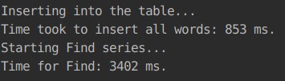
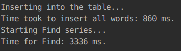
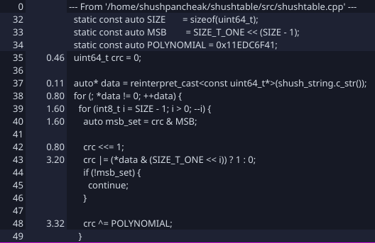
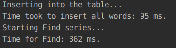
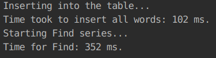
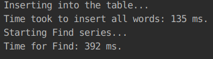
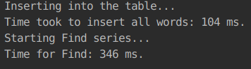
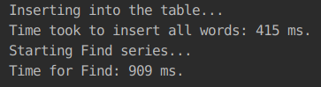

# shushtable
A fast implementation of a hashtable on short strings.

## Efficiency analysis
The original results:
|||
|---------------------|---------------------|
|-O2 -g               |               -O3 -g|

In `KCacheGrind` we can notice two things:
1. There are too many cache misses.


2. There is quite some time spent on calculating crc.



After applying some intrinsics to the code, we yield the following result:
|||
|-----------------------|-----------------------|
|-O2 -g                 |              -O3 -g   |

After allocating nodes in chunks of `PAGE_SIZE` length, we get:
|||
|-----------------------------|-----------------------------|
|-O2 -g                       |         -O3 -g              |

Final result:




## Build
```shell
mkdir build && cd build
cmake .. # "-UBUILD_TESTS -DBUILD_TESTS=ON" to build tests, "-ULIBRARY_TYPE -DLIBRARY_TYPE=SHARED" for building shared library
make
```

## How to use
Download the repository and place it into your project directory. In your project's CMakeLists.txt file, insert the following lines:
```cmake
...
add_subdirectory(shushtable)
...
target_link_libraries(${PROJECT_NAME} shushtable)
...
```

## Build documentation
```shell
doxygen
```
Documentation will be generated in the directory named `docs`.
